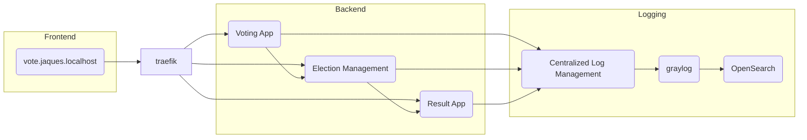

# Lab Quarkus - Sistema de Votação Eletrônica

Projeto de sistema de votação eletrônica desenvolvido com Quarkus, implementando arquitetura hexagonal e padrões de design modernos.

## Status do Projeto

✅ **Compilação:** Todos os módulos compilam com sucesso  
✅ **Testes:** 12/12 testes passando (0 falhas, 0 erros)  
✅ **Configuração:** DevServices desabilitado, containers manuais configurados

## Definição do Escopo
- Candidatos são listados, cadastrados e editados
- Todos os candidatos registrados participam de uma eleição, quando for iniciada
- Candidatos recebem votos de eleitores
- Resultado disponível em tempo real

### Requisitos não funcionais:
- Confiabilidade
- Disponibilidade
- Interoperabilidade
- Escalabilidade




### Tecnologias e Ferramentas Utilizadas

**Ambiente de Desenvolvimento:**

* java 17 (jdk) 
* java 21 graalvm (jdk) para compilação nativa 
* IntelliJ IDEA
**Framework:**  Quarkus
* Docker
* Docker Compose
* Graylog (Centralized Log Management)
* OpenSearch (Elasticsearch)
* Jaeger (Tracing)
* MongoDB (Database)
* Traefik (Reverse Proxy)
* freebuilder (geração de código automática de Builder Pattern)
* Jackson (para serialização e desserialização de JSON)
* RestAssured (para testes de integração)

**Build e Gerenciamento de Dependências:** > Maven

**Extensões do Quarkus:**

* CDI (Contexts and Dependency Injection)
* Logging GELF (Graylog Extended Log Format)
* OpenTelemetry
* RESTEasy Reactive
* SmallRye Context Propagation
* SmallRye Health
* Vert.x (para programação reativa)
* Mokito (para testes)
* Instancio (para injeção de dependência)


## Pré-requisitos

- Java 17 (JDK)
- Maven 3.8+
- Docker e Docker Compose
- Git

## Configuração do Ambiente

### 1. Iniciar Containers Docker

Os containers MariaDB e Redis devem estar rodando com as portas expostas:

```sh
# Iniciar banco de dados e cache
docker compose up -d database caching

# Verificar se os containers estão rodando
docker ps | grep -E "database|caching"
```

**Importante:** Devido à incompatibilidade entre Testcontainers e Docker API 1.44+, os DevServices foram desabilitados. É necessário iniciar os containers manualmente antes de executar os testes.

### 2. Configuração das Portas

O `docker-compose.yml` já está configurado para expor as portas:
- MariaDB: `localhost:3306`
- Redis: `localhost:6379`

### 3. Variáveis de Ambiente (Opcional)

O projeto utiliza as seguintes variáveis no `application.properties`:

```properties
# Database
quarkus.datasource.jdbc.url=jdbc:mariadb://localhost:3306/election-management-database
quarkus.datasource.username=election-management-user
quarkus.datasource.password=election-management-password

# Redis
quarkus.redis.hosts=redis://localhost:6379

# OpenTelemetry
quarkus.otel.exporter.otlp.traces.endpoint=http://localhost:4317
```

Para sobrescrever em diferentes ambientes:

```sh
# Development
export QUARKUS_DATASOURCE_JDBC_URL=jdbc:mariadb://localhost:3306/election-management-database

# Production
export QUARKUS_DATASOURCE_JDBC_URL=jdbc:mariadb://prod-db:3306/election-db
export QUARKUS_REDIS_HOSTS=redis://prod-redis:6379
```

### 4. Executar Testes

```sh
cd election-management
./mvnw test
```

Todos os 12 testes devem passar com sucesso.

## Estrutura do Projeto

O projeto está dividido em 3 microserviços:

### 1. Election Management (`election-management`)

Gerenciamento de candidatos e eleições.

**Endpoints:**

- `POST /api/candidates` - Criar novo candidato
- `PUT /api/candidates/{id}` - Atualizar candidato
- `GET /api/candidates` - Listar todos os candidatos
- `POST /api/elections` - Criar nova eleição
- `GET /api/elections` - Listar eleições

**Banco de Dados:** MariaDB (porta 3306)

### 2. Voting App (`voting-app`)

Aplicação para votação em tempo real.

**Endpoints:**

- `GET /api/voting` - Listar eleições disponíveis
- `POST /api/voting/elections/{electionId}/candidates/{candidateId}` - Registrar voto

**Cache:** Redis (porta 6379)

### 3. Result App (`result-app`)

Exibição de resultados em tempo real via streaming.

**Endpoints:**

- `GET /` - Stream de resultados (atualização a cada 10 segundos)

**Tecnologia:** Server-Sent Events (SSE) com Mutiny

### Fluxo de Dados

```
1. Criação de Candidatos e Eleições
   Client → POST /api/candidates → Election Management → MariaDB

2. Votação
   Client → POST /api/voting/elections/{id}/candidates/{id} → Voting App → Redis (cache)
   
3. Resultados em Tempo Real
   Result App → Redis PubSub → Server-Sent Events → Client (atualização a cada 10s)
```

### Persistência e Cache

- **MariaDB:** Armazena candidatos e eleições (source of truth)
- **Redis:** Cache de votação e sincronização em tempo real
  - Estrutura de dados: Sorted Set (`ZADD`, `ZINCRBY`, `ZRANGE`)
  - Pub/Sub para notificações de novos votos

## API - Exemplos de Uso

### Criar Candidato

```sh
curl -X POST http://localhost:8080/api/candidates \
  -H "Content-Type: application/json" \
  -d '{
    "givenName": "João",
    "familyName": "Silva",
    "email": "joao.silva@example.com",
    "phone": "+55 11 98765-4321",
    "jobTitle": "Desenvolvedor Full Stack",
    "photo": "https://example.com/photo.jpg"
  }'
```

### Criar Eleição

```sh
curl -X POST http://localhost:8080/api/elections
```

### Votar

```sh
curl -X POST http://localhost:8080/api/voting/elections/{election-id}/candidates/{candidate-id}
```

### Ver Resultados (Stream)

```sh
curl http://localhost:8080/
```

## Docker Compose - Comandos Completos

```sh
# Iniciar todos os serviços de infraestrutura
docker compose up -d reverse-proxy jaeger mongodb opensearch graylog caching database

# Ou iniciar serviços individuais
docker compose up -d database caching  # MariaDB e Redis para desenvolvimento/testes
docker compose up -d reverse-proxy     # Traefik
docker compose up -d jaeger           # OpenTelemetry/Tracing
docker compose up -d mongodb opensearch graylog  # Logging stack

# Criar input GELF no Graylog (após graylog estar rodando)
curl -H "Content-Type: application/json" \
  -H "Authorization: Basic YWRtaW46YWRtaW4=" \
  -H "X-Requested-By: curl" \
  -X POST -v \
  -d '{"title":"udp input","configuration":{"recv_buffer_size":262144,"bind_address":"0.0.0.0","port":12201,"decompress_size_limit":8388608},"type":"org.graylog2.inputs.gelf.udp.GELFUDPInput","global":true}' \
  http://logging.private.jaques.localhost/api/system/inputs

# Parar todos os serviços
docker compose down
```

## Quarkus - Comandos para Criar Projetos
```sh
quarkus create app br.com.jaquesprojetos:election-management \
--extension='resteasy-reactive, logging-gelf, opentelemetry, smallrye-context-propagation, smallrye-health' \
--no-code

quarkus create app br.com.jaquesprojetos:voting-app \
--extension='resteasy-reactive, logging-gelf, opentelemetry, smallrye-context-propagation, smallrye-health' \
--no-code

quarkus create app br.com.jaquesprojetos:result-app \
--extension='resteasy-reactive, logging-gelf, opentelemetry, smallrye-context-propagation, smallrye-health' \
--no-code

quarkus add extension
quarkus extension add 'quarkus-flyway' 'quarkus-jdbc-mariadb'
```

## Executando o Projeto

### Modo Desenvolvimento

```sh
cd election-management  # ou voting-app, ou result-app
./mvnw quarkus:dev
```

**Quarkus Dev UI:** http://localhost:8080/q/dev

### Executar Testes

```sh
# Garantir que os containers estão rodando
docker compose up -d database caching

# Executar testes
cd election-management
./mvnw test
```

### Build para Produção

```sh
./mvnw package
```

## Application.properties
```
quarkus.application.name=election-management // voting-app // result-app
quarkus.shutdown.timeout=5S

# LOGGING
%prod.quarkus.log.handler.gelf.enabled=true
%prod.quarkus.log.handler.gelf.additional-field."app".value=${quarkus.application.name}
%prod.quarkus.log.handler.gelf.include-full-mdc=true
%prod.quarkus.log.console.format=%d{HH:mm:ss} %-5p traceId=%X{traceId}, parentId=%X{parentId}, spanId=%X{spanId}, sampled=%X{sampled} [%c{2.}] (%t) %s%e%n

# OPENTELEMETRY
%prod.quarkus.opentelemetry.enabled=true
%dev.quarkus.opentelemetry.enabled=false
```

## Blue-green deployment
> **Blue-green deployment** é uma técnica de implantação de software que
> envolve
> a criação de dois ambientes de produção idênticos, um ambiente "azul" (blue) e um ambiente "verde" (green).
<br> Enquanto uma versão do aplicativo é executada no ambiente azul, a nova versão é implantada e testada no ambiente verde. 
<br> Quando a nova versão é considerada estável, o tráfego do usuário é direcionado do ambiente azul para o ambiente verde.
<br> Dessa forma, o ambiente azul permanece disponível e em execução para
> que possa ser facilmente restaurado em caso de falhas ou alterações.
<br> Esse método é usado para reduzir o tempo de inatividade e minimizar os riscos de falhas durante a implantação de software, que a nova versão seja implantada e testada antes que o tráfego do usuário seja redirecionado para ela

# Padrões de Arquitetura de Software
*Arquitetura Hexagonal, Arquitetura Limpa, Arquitetura Cebola*

>A arquitetura hexagonal, a arquitetura limpa e a arquitetura cebola são 
> todos modelos de arquitetura de software que buscam separar as 
  responsabilidades e promover a modularidade e a manutenibilidade do código.

>A **arquitetura hexagonal** é um modelo que coloca o núcleo da aplicação no 
> centro, cercado por portas (interfaces) que fornecem entradas e saídas para 
  a aplicação, e adaptadores que conectam essas portas à infraestrutura externa, como bancos de dados e APIs de terceiros. Essa arquitetura promove a separação de preocupações e permite que a lógica de negócios seja testada independentemente da infraestrutura externa.

> A **arquitetura** limpa é um modelo que coloca a lógica de negócios no centro,
> cercada por camadas que fornecem abstrações para a infraestrutura externa. A arquitetura limpa tem como objetivo
> isolar a lógica de negócios da infraestrutura externa e promover a testabilidade, manutenibilidade e escalabilidade do
> código.

> A **arquitetura cebola** é um modelo que coloca a lógica de negócios no centro,
> cercada por camadas que fornecem abstrações para as camadas externas. A arquitetura cebola tem como objetivo garantir
> que as camadas mais internas sejam independentes das camadas externas, permitindo que a lógica de negócios seja testada
> de forma isolada. A arquitetura cebola é semelhante à arquitetura limpa, mas é mais focada na independência das camadas
> internas.

fonte:
https://www.thoughtworks.com/insights/blog/architecture/demystify-software-architecture-patterns


## Create || Remove folders structures
```sh
create folder structure
mkdir -p {election-management,voting-app,result-app}/src/main/java/{api,domain,infrastructure}

remove folder structure
rm -rf -p {election-management,voting-app,result-app}/src/main/java/{api,domain,infrastructure} 
```

# Start the project
```sh
quarkus dev
```
## Quarkus Dev Services
> Quarkus Dev Services é uma extensão do Quarkus que fornece serviços de desenvolvimento
> para bancos de dados, mensageria e outros serviços comuns.
---
## Quarkus Dev UI
Localhost: http://localhost:8080/q/dev
---

**Quarkus Guides**
> <br> https://quarkus.io/guides/maven-tooling#dev-mode
> <br> https://quarkus.io/guides/dev-services
> <br> https://quarkus.io/guides/lifecycle#the-main-method
> <br> https://quarkus.io/guides/config#configuring-quarkus


## **Domain Model**

> https://martinfowler.com/eaaCatalog/domainModel.html
> <br>https://docs.oracle.com/en/java/javase/17/language/records.html

## **Testing**

> <br>https://quarkus.io/guides/getting-started-testing
> <br>https://quarkus.io/guides/continuous-testing
> <br>https://martinfowler.com/bliki/TestDrivenDevelopment.html
> <br>https://www.thoughtworks.com/insights/blog/test-driven-development-best-thing-has-happened-software-design
> <br>https://www.thoughtworks.com/insights/topic/testing   

##  **Service Layer**

> <br>https://martinfowler.com/eaaCatalog/serviceLayer.html
> <br>https://medium.com/@osuradiss/dependency-injection-demystified-literature-based-review-4c595c610c2d
> <br>https://quarkus.io/guides/cdi-reference

##  **Repository**

> <br>https://martinfowler.com/eaaCatalog/repository.html
> <br>https://martinfowler.com/eaaCatalog/queryObject.html


##  **Migration**
> <br> https://martinfowler.com/articles/evodb.html
> <br> https://quarkus.io/guides/flywayhttps://quarkus.io/guides/databases-dev-services

##  **Data Mapper**
> <br> https://martinfowler.com/eaaCatalog/dataMapper.html
> <br> https://quarkus.io/guides/hibernate-ormhttps://quarkus.io/guides/datasource

##  **Testes de integração**
```sh
# Enable JDBC telemetry
quarkus.datasource.jdbc.telemetry=true
```

## **Mockaroo for Seed**

 > https://www.mockaroo.com/
 > <br> Mockaroo é um gerador de dados de teste que permite criar grandes 
 > quantidades de dados realistas em formatos como CSV, JSON, SQL e Excel.


## **Redis**

 > <br> https://quarkus.io/guides/redis
 > <br> https://quarkus.io/guides/redis-reference
 > <br> https://redis.io/commands/zadd
 > <br> https://redis.io/commands/zrange
 > <br> https://redis.io/commands/zincrby

**Redis comandos**

```sh
 docker ps || grep redis
 docker exec -it <containerID> redis-cli
 ZADD election:election-id 0 "candidate-1" 0 "candidate-2"
 keys *
 zrange election:election-id 0 -1 WITHSCORES 
 zincrby election:election-id 1 "candidate-1"
```

## **Event Driven**

 > <br> https://martinfowler.com/articles/201701-event-driven.html
 > <br> https://redis.io/docs/manual/pubsub

## **Lifecycle**
> <br> https://quarkus.io/guides/lifecycle

## **Memoization/Caching**
> <br> https://quarkus.io/guides/cache

## **Reactive**
> <br> https://quarkus.io/guides/getting-started-reactive
> <br> https://quarkus.io/guides/quarkus-reactive-architecture
> <br> https://quarkus.io/guides/mutiny-primer
> <br> https://smallrye.io/smallrye-mutiny

## **Curl para testes manuals**

```sh
curl localhost:8080/api/voting
curl -X POST localhost:8080/api/voting/elections/123/candidates/candidate-2
curl -X POST localhost:8080/api/elections 
```

## **Maria Db**

```sh
docker exec -it [container id] mysql -uquarkus -pquarkus quarkus
select * from election_candidate;
```

## Troubleshooting

### Erro: "Connection refused" ao executar testes

**Causa:** Containers Docker não estão rodando ou portas não estão expostas.

**Solução:**

```sh
# Verificar containers ativos
docker ps

# Se não houver containers, iniciar database e caching
docker compose up -d database caching

# Verificar se as portas estão acessíveis
nc -zv localhost 3306  # MariaDB
nc -zv localhost 6379  # Redis
```

### Erro: "Port 3306 already in use"

**Causa:** Outra instância do MySQL/MariaDB está usando a porta.

**Solução:**

```sh
# Opção 1: Parar o serviço local
sudo systemctl stop mysql
sudo systemctl stop mariadb

# Opção 2: Alterar porta no docker-compose.yml
# Em services.database.ports, trocar "3306:3306" por "3307:3306"
# E em application.properties, usar localhost:3307
```

### Testes falhando: "Table doesn't exist"

**Causa:** Flyway migrations não foram executadas.

**Solução:**

```sh
# Limpar banco de dados
docker compose down database
docker volume rm lab-java-quarkus_db-volume

# Recriar e executar migrations
docker compose up -d database
cd election-management
./mvnw clean compile  # Flyway executará as migrations
./mvnw test
```

### DevServices não funciona

**Causa:** Testcontainers 1.20.4 é incompatível com Docker API 1.44+.

**Solução:** Este projeto já está configurado com DevServices desabilitados (`quarkus.devservices.enabled=false`). Use os containers manuais conforme documentado acima.

### MariaDB: "Access denied for user"

**Causa:** Credenciais incorretas.

**Solução:**

```sh
# Verificar credenciais no docker-compose.yml:
# MYSQL_USER=election-management-user
# MYSQL_PASSWORD=election-management-password
# MYSQL_DATABASE=election-management-database

# Testar conexão
docker exec -it $(docker ps -qf "name=database") \
  mysql -uelection-management-user -pelection-management-password election-management-database
```

## Contribuindo

1. Fork o projeto
2. Crie uma branch para sua feature (`git checkout -b feature/MinhaFeature`)
3. Commit suas mudanças (`git commit -m 'Adiciona MinhaFeature'`)
4. Push para a branch (`git push origin feature/MinhaFeature`)
5. Abra um Pull Request

## Licença

Este projeto é um laboratório de estudos e está disponível para fins educacionais.
