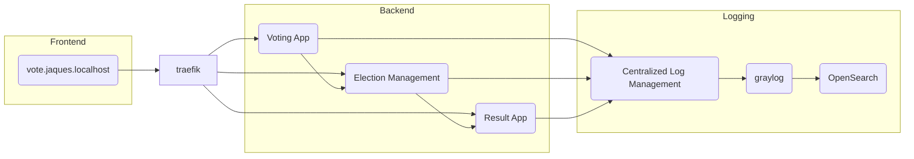

## Definição do Escopo
- Candidatos são listados, cadastrados e editados
- Todos os candidatos registrados participam de uma eleição, quando for iniciada
- Candidatos recebem votos de eleitores
- Resultado disponível em tempo real

### Requisitos não funcionais:
- Confiabilidade
- Disponibilidade
- Interoperabilidade
- Escalabilidade




### Tecnologias e Ferramentas Utilizadas

**Ambiente de Desenvolvimento:**

* java 17 (jdk) 
* java 21 graalvm (jdk) para compilação nativa 
* IntelliJ IDEA
**Framework:**  Quarkus
* Docker
* Docker Compose
* Graylog (Centralized Log Management)
* OpenSearch (Elasticsearch)
* Jaeger (Tracing)
* MongoDB (Database)
* Traefik (Reverse Proxy)
* freebuilder (geração de código automática de Builder Pattern)
* Jackson (para serialização e desserialização de JSON)
* RestAssured (para testes de integração)

**Build e Gerenciamento de Dependências:** > Maven

**Extensões do Quarkus:**

* CDI (Contexts and Dependency Injection)
* Logging GELF (Graylog Extended Log Format)
* OpenTelemetry
* RESTEasy Reactive
* SmallRye Context Propagation
* SmallRye Health
* Vert.x (para programação reativa)
* Mokito (para testes)
* Instancio (para injeção de dependência)


## Docker-compose commands to start the services and create the inputs in Graylog
```sh
docker compose up -d reverse-proxy
docker compose up -d jaeger
docker compose up -d mongodb opensearch
docker compose up -d graylog
curl -H "Content-Type: application/json"
-H "Authorization: Basic YWRtaW46YWRtaW4="
-H "X-Requested-By: curl"
-X POST -v -d '{"title":"udp input", "configuration": {"recv_buffer_size":262144, "bind_address": "0.0.0.0", "port":12201,"decompress_size_limit":8388608},"type":"org.graylog2.inputs.gelf.udp.GELFUDPInput", "global":true}' http://logging.private.jaques.localhost/api/system/inputs   
docker compose up -d caching database

# start all services
up  docker compose up -d reverse-proxy jaeger mongodb opensearch graylog caching database
down    docker compose down reverse-proxy jaeger mongodb opensearch graylog caching database

```

## Quarkus commands to create the projects
```sh
quarkus create app br.com.jaquesprojetos:election-management \
--extension='resteasy-reactive, logging-gelf, opentelemetry, smallrye-context-propagation, smallrye-health' \
--no-code

quarkus create app br.com.jaquesprojetos:voting-app \
--extension='resteasy-reactive, logging-gelf, opentelemetry, smallrye-context-propagation, smallrye-health' \
--no-code

quarkus create app br.com.jaquesprojetos:result-app \
--extension='resteasy-reactive, logging-gelf, opentelemetry, smallrye-context-propagation, smallrye-health' \
--no-code

quarkus add extension
quarkus extension add 'quarkus-flyway' 'quarkus-jdbc-mariadb'
```
# Application.properties
```
quarkus.application.name=election-management // voting-app // result-app
quarkus.shutdown.timeout=5S

# LOGGING
%prod.quarkus.log.handler.gelf.enabled=true
%prod.quarkus.log.handler.gelf.additional-field."app".value=${quarkus.application.name}
%prod.quarkus.log.handler.gelf.include-full-mdc=true
%prod.quarkus.log.console.format=%d{HH:mm:ss} %-5p traceId=%X{traceId}, parentId=%X{parentId}, spanId=%X{spanId}, sampled=%X{sampled} [%c{2.}] (%t) %s%e%n

# OPENTELEMETRY
%prod.quarkus.opentelemetry.enabled=true
%dev.quarkus.opentelemetry.enabled=false
```

## Blue-green deployment
> **Blue-green deployment** é uma técnica de implantação de software que
> envolve
> a criação de dois ambientes de produção idênticos, um ambiente "azul" (blue) e um ambiente "verde" (green).
<br> Enquanto uma versão do aplicativo é executada no ambiente azul, a nova versão é implantada e testada no ambiente verde. 
<br> Quando a nova versão é considerada estável, o tráfego do usuário é direcionado do ambiente azul para o ambiente verde.
<br> Dessa forma, o ambiente azul permanece disponível e em execução para
> que possa ser facilmente restaurado em caso de falhas ou alterações.
<br> Esse método é usado para reduzir o tempo de inatividade e minimizar os riscos de falhas durante a implantação de software, que a nova versão seja implantada e testada antes que o tráfego do usuário seja redirecionado para ela

# Padrões de Arquitetura de Software
*Arquitetura Hexagonal, Arquitetura Limpa, Arquitetura Cebola*

>A arquitetura hexagonal, a arquitetura limpa e a arquitetura cebola são 
> todos modelos de arquitetura de software que buscam separar as 
  responsabilidades e promover a modularidade e a manutenibilidade do código.

>A **arquitetura hexagonal** é um modelo que coloca o núcleo da aplicação no 
> centro, cercado por portas (interfaces) que fornecem entradas e saídas para 
  a aplicação, e adaptadores que conectam essas portas à infraestrutura externa, como bancos de dados e APIs de terceiros. Essa arquitetura promove a separação de preocupações e permite que a lógica de negócios seja testada independentemente da infraestrutura externa.

> A **arquitetura** limpa é um modelo que coloca a lógica de negócios no centro,
> cercada por camadas que fornecem abstrações para a infraestrutura externa. A arquitetura limpa tem como objetivo
> isolar a lógica de negócios da infraestrutura externa e promover a testabilidade, manutenibilidade e escalabilidade do
> código.

> A **arquitetura cebola** é um modelo que coloca a lógica de negócios no centro,
> cercada por camadas que fornecem abstrações para as camadas externas. A arquitetura cebola tem como objetivo garantir
> que as camadas mais internas sejam independentes das camadas externas, permitindo que a lógica de negócios seja testada
> de forma isolada. A arquitetura cebola é semelhante à arquitetura limpa, mas é mais focada na independência das camadas
> internas.

fonte:
https://www.thoughtworks.com/insights/blog/architecture/demystify-software-architecture-patterns


## Create || Remove folders structures
```sh
create folder structure
mkdir -p {election-management,voting-app,result-app}/src/main/java/{api,domain,infrastructure}

remove folder structure
rm -rf -p {election-management,voting-app,result-app}/src/main/java/{api,domain,infrastructure} 
```

# Start the project
```sh
quarkus dev
```
## Quarkus Dev Services
> Quarkus Dev Services é uma extensão do Quarkus que fornece serviços de desenvolvimento
> para bancos de dados, mensageria e outros serviços comuns.
---
## Quarkus Dev UI
Localhost: http://localhost:8080/q/dev
---

**Quarkus Guides**
> <br> https://quarkus.io/guides/maven-tooling#dev-mode
> <br> https://quarkus.io/guides/dev-services
> <br> https://quarkus.io/guides/lifecycle#the-main-method
> <br> https://quarkus.io/guides/config#configuring-quarkus


## **Domain Model**

> https://martinfowler.com/eaaCatalog/domainModel.html
> <br>https://docs.oracle.com/en/java/javase/17/language/records.html

## **Testing**

> <br>https://quarkus.io/guides/getting-started-testing
> <br>https://quarkus.io/guides/continuous-testing
> <br>https://martinfowler.com/bliki/TestDrivenDevelopment.html
> <br>https://www.thoughtworks.com/insights/blog/test-driven-development-best-thing-has-happened-software-design
> <br>https://www.thoughtworks.com/insights/topic/testing   

##  **Service Layer**

> <br>https://martinfowler.com/eaaCatalog/serviceLayer.html
> <br>https://medium.com/@osuradiss/dependency-injection-demystified-literature-based-review-4c595c610c2d
> <br>https://quarkus.io/guides/cdi-reference

##  **Repository**

> <br>https://martinfowler.com/eaaCatalog/repository.html
> <br>https://martinfowler.com/eaaCatalog/queryObject.html


##  **Migration**
> <br> https://martinfowler.com/articles/evodb.html
> <br> https://quarkus.io/guides/flywayhttps://quarkus.io/guides/databases-dev-services

##  **Data Mapper**
> <br> https://martinfowler.com/eaaCatalog/dataMapper.html
> <br> https://quarkus.io/guides/hibernate-ormhttps://quarkus.io/guides/datasource

##  **Testes de integração**
```sh
# Enable JDBC telemetry
quarkus.datasource.jdbc.telemetry=true
```

## **Mockaroo for Seed**

 > https://www.mockaroo.com/
 > <br> Mockaroo é um gerador de dados de teste que permite criar grandes 
 > quantidades de dados realistas em formatos como CSV, JSON, SQL e Excel.


## **Redis**

 > <br> https://quarkus.io/guides/redis
 > <br> https://quarkus.io/guides/redis-reference
 > <br> https://redis.io/commands/zadd
 > <br> https://redis.io/commands/zrange
 > <br> https://redis.io/commands/zincrby

**Redis comandos**

```sh
 docker ps || grep redis
 docker exec -it <containerID> redis-cli
 ZADD election:election-id 0 "candidate-1" 0 "candidate-2"
 keys *
 zrange election:election-id 0 -1 WITHSCORES 
```

## **Event Driven**

 > <br> https://martinfowler.com/articles/201701-event-driven.html
 > <br> https://redis.io/docs/manual/pubsub

## **Lifecycle**
> <br> https://quarkus.io/guides/lifecycle

## **Memoization/Caching**
> <br> https://quarkus.io/guides/cache

## **Reactive**
> <br> https://quarkus.io/guides/getting-started-reactive
> <br> https://quarkus.io/guides/quarkus-reactive-architecture
> <br> https://quarkus.io/guides/mutiny-primer
> <br> https://smallrye.io/smallrye-mutiny

## **Curl**

```sh
curl localhost:8080/api/voting
curl -X POST localhost:8080/api/voting/elections/123/candidates/candidate-2
```
